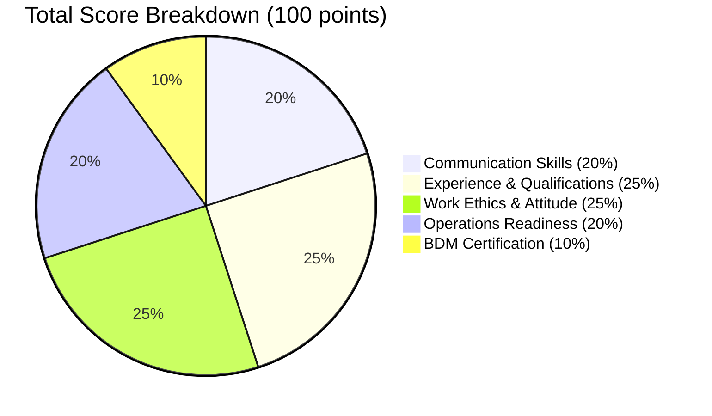
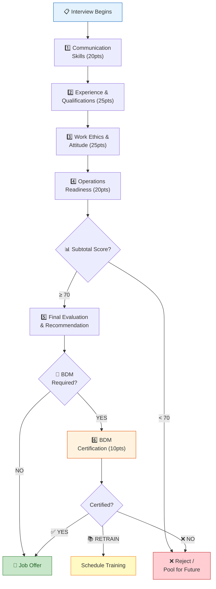

```
╔══════════════════════════════════════════════════════════════════════════╗
║                                                                          ║
║        ███████╗██╗     ███████╗██╗   ██╗███████╗ █████╗ ██╗             ║
║        ██╔════╝██║     ██╔════╝██║   ██║██╔════╝██╔══██╗██║             ║
║        █████╗  ██║     █████╗  ██║   ██║█████╗  ███████║██║             ║
║        ██╔══╝  ██║     ██╔══╝  ╚██╗ ██╔╝██╔══╝  ██╔══██║██║             ║
║        ███████╗███████╗███████╗ ╚████╔╝ ███████╗██║  ██║███████╗        ║
║        ╚══════╝╚══════╝╚══════╝  ╚═══╝  ╚══════╝╚═╝  ╚═╝╚══════╝        ║
║                                                                          ║
║                    B P O   S O L U T I O N S                             ║
║                                                                          ║
║  ─────────────────────────────────────────────────────────────────────   ║
║                                                                          ║
║              📋 INTERVIEW SCORECARD & EVALUATION FORM                    ║
║              👤 Candidate Assessment Tool v2.0                           ║
║              🔒 Classification: Internal — Confidential                  ║
║                                                                          ║
╚══════════════════════════════════════════════════════════════════════════╝
```

# ELEVEAL BPO — INTERVIEW SCORECARD

**Form Version:** 2.0 | **Effective Date:** May 25, 2026 | **Total Score:** 100 points

---


## 📌 CANDIDATE INFORMATION

| Field | Details |
|-------|---------|
| **Candidate Name** | ___________________________________________ |
| **Contact Number** | ___________________________________________ |
| **Email Address** | ___________________________________________ |
| **Position Applied** | ___________________________________________ |
| **Campaign / Account** | ___________________________________________ |
| **Source** | ☐ Facebook  ☐ LinkedIn  ☐ Indeed  ☐ TikTok  ☐ Referral  ☐ Other: _______ |
| **Date of Interview** | ___________________________________________ |
| **Time Started** | ____:____ AM/PM |
| **Time Ended** | ____:____ AM/PM |
| **Interviewer Name** | ___________________________________________ |
| **Interviewer Role** | ☐ Recruiter  ☐ AM  ☐ BDM  ☐ QA  ☐ GM |

---

## 📋 INTERVIEW TYPE

```
┌─────────────────────────────────────────────────────────────────┐
│  ☐ INITIAL INTERVIEW   ☐ FINAL INTERVIEW   ☐ MOCK CALL          │
│  ☐ BDM CERTIFICATION   ☐ CLIENT INTERVIEW                       │
└─────────────────────────────────────────────────────────────────┘
```

---


## 🎯 SCORING RUBRIC (Use for ALL Sections)

| Score | Rating | Description |
|:-----:|:-------|:------------|
| **5** | 🌟 **Excellent** | Exceeds expectations; exceptional skill/attitude; ready for any account |
| **4** | ✅ **Good** | Meets expectations consistently; strong candidate |
| **3** | 👌 **Average** | Acceptable; meets minimum requirements; trainable |
| **2** | ⚠️ **Needs Improvement** | Below standard; significant gaps; requires extensive coaching |
| **1** | ❌ **Poor** | Does not meet requirements; not recommended |

> 💡 **Scoring Tip:** Use **3** as your baseline. Only give **5** for truly exceptional responses. Be honest — over-scoring leads to bad hires.

---


## 📊 SCORE DISTRIBUTION



---

## SECTION 1️⃣ — COMMUNICATION SKILLS
**Weight: 20% | Maximum: 20 points**

| # | Criteria | Score (1-5) | Sample Questions / What to Look For |
|---|---------|:-----------:|--------------------------------------|
| 1.1 | **English Communication Skills** | _____ /5 | Grammar, vocabulary, fluency, accent neutrality |
| 1.2 | **Clarity of Speech** | _____ /5 | Articulation, pace, tone, pronunciation |
| 1.3 | **Listening Skills** | _____ /5 | Comprehension, ability to follow instructions, asks clarifying questions |
| 1.4 | **Confidence & Professionalism** | _____ /5 | Composure, posture (video), professional language |

**Section 1 Total: _____ / 20**

### 💬 Comments / Observations:
```
_____________________________________________________________________
_____________________________________________________________________
_____________________________________________________________________
_____________________________________________________________________
```

---

## SECTION 2️⃣ — EXPERIENCE & QUALIFICATIONS
**Weight: 25% | Maximum: 25 points**

| # | Criteria | Score (1-5) | What to Evaluate |
|---|---------|:-----------:|------------------|
| 2.1 | **Relevant BPO Experience** | _____ /5 | Years in BPO, type of accounts handled, tenure stability |
| 2.2 | **Technical / Account Knowledge** | _____ /5 | Familiarity with tools (CRM, dialers), industry knowledge |
| 2.3 | **Customer Service Skills** | _____ /5 | Empathy, de-escalation, customer-first mindset |
| 2.4 | **Sales Skills** *(if applicable)* | _____ /5 | Persuasion, objection handling, closing techniques |
| 2.5 | **Problem Solving Ability** | _____ /5 | Critical thinking, scenario handling, resourcefulness |

**Section 2 Total: _____ / 25**

### 💬 Comments / Observations:
```
_____________________________________________________________________
_____________________________________________________________________
_____________________________________________________________________
_____________________________________________________________________
```

---

## SECTION 3️⃣ — WORK ETHICS & ATTITUDE
**Weight: 25% | Maximum: 25 points**

| # | Criteria | Score (1-5) | What to Evaluate |
|---|---------|:-----------:|------------------|
| 3.1 | **Professional Attitude** | _____ /5 | Maturity, respect, openness to feedback |
| 3.2 | **Adaptability & Flexibility** | _____ /5 | Open to schedule changes, account shifts, role pivots |
| 3.3 | **Teamwork Potential** | _____ /5 | Collaboration mindset, past team experiences |
| 3.4 | **Reliability & Accountability** | _____ /5 | Past attendance record, ownership of mistakes |
| 3.5 | **Willingness to Learn** | _____ /5 | Growth mindset, asks questions, embraces training |

**Section 3 Total: _____ / 25**

### 💬 Comments / Observations:
```
_____________________________________________________________________
_____________________________________________________________________
_____________________________________________________________________
_____________________________________________________________________
```

---

## SECTION 4️⃣ — OPERATIONS READINESS
**Weight: 20% | Maximum: 20 points**

| # | Criteria | Score (1-5) | What to Evaluate |
|---|---------|:-----------:|------------------|
| 4.1 | **Shift Availability** | _____ /5 | Willing to work assigned shift (graveyard, weekends, holidays) |
| 4.2 | **Work Setup / Equipment Readiness** | _____ /5 | PC specs, internet speed (≥10 Mbps), headset, quiet workspace |
| 4.3 | **Attendance Commitment** | _____ /5 | No conflicts (school, second job), reliable transportation/setup |
| 4.4 | **Ability to Handle Pressure** | _____ /5 | Stress management, multi-tasking, irate customer scenarios |

**Section 4 Total: _____ / 20**

### 🖥️ Technical Setup Verification:

| Item | Specification | ✅ / ❌ |
|------|--------------|:------:|
| PC/Laptop | Min. i5 / Ryzen 5, 8GB RAM | ☐ |
| Internet Speed | Min. 10 Mbps download | ☐ |
| Backup Internet | Mobile data / second ISP | ☐ |
| Headset | Noise-canceling, USB | ☐ |
| Workspace | Quiet, private, well-lit | ☐ |
| Power Backup | UPS / Generator | ☐ |

### 💬 Comments / Observations:
```
_____________________________________________________________________
_____________________________________________________________________
_____________________________________________________________________
```

---

## SECTION 5️⃣ — FINAL EVALUATION SUMMARY

### 📊 Score Compilation Table

| Section | Maximum | Score | % Achieved |
|---------|:-------:|:-----:|:----------:|
| 1. Communication Skills | 20 | _____ | _____% |
| 2. Experience & Qualifications | 25 | _____ | _____% |
| 3. Work Ethics & Attitude | 25 | _____ | _____% |
| 4. Operations Readiness | 20 | _____ | _____% |
| **SUBTOTAL (HR/Recruitment)** | **90** | **_____** | **_____%** |
| 5. BDM Certification *(if applicable)* | 10 | _____ | _____% |
| **🎯 GRAND TOTAL** | **100** | **_____** | **_____%** |

---

### 🏆 SCORE INTERPRETATION GUIDE

```
┌─────────────────────────────────────────────────────────────────────┐
│  SCORE       │  RATING              │  RECOMMENDATION                 │
├──────────────┼──────────────────────┼─────────────────────────────────┤
│  90 – 100    │  🌟 OUTSTANDING       │  Hire immediately — top tier    │
│  80 – 89     │  ✅ HIGHLY QUALIFIED  │  Recommended for hire           │
│  70 – 79     │  👌 QUALIFIED         │  Conditional hire / pooling     │
│  60 – 69     │  ⚠️ MARGINAL          │  Hold / requires re-evaluation  │
│  Below 60    │  ❌ NOT QUALIFIED     │  Reject — does not meet bar     │
└─────────────────────────────────────────────────────────────────────┘
```

---

### ✅ INITIAL INTERVIEW RECOMMENDATION
*(To be completed by Recruiter / HR)*

```
┌─────────────────────────────────────────────────────────────────┐
│  ☐ ✅ PASSED              → Proceed to Final Interview           │
│  ☐ 📋 FOR FINAL INTERVIEW → Endorse to Account Manager / BDM    │
│  ☐ 📂 POOLING             → Talent pool for future openings     │
│  ☐ ❌ FAILED              → Send rejection, do not proceed      │
└─────────────────────────────────────────────────────────────────┘
```

### 🎯 FINAL INTERVIEW RECOMMENDATION
*(To be completed by Account Manager / BDM)*

```
┌─────────────────────────────────────────────────────────────────┐
│  ☐ 🎉 HIRED                  → Send job offer immediately        │
│  ☐ 👔 FOR CLIENT APPROVAL    → Endorse to client for final ok   │
│  ☐ ⏸️ HOLD                   → Pending additional review         │
│  ☐ ❌ REJECTED               → Send rejection notification       │
└─────────────────────────────────────────────────────────────────┘
```

### 📝 Interviewer Final Notes:
```
STRENGTHS:
_____________________________________________________________________
_____________________________________________________________________
_____________________________________________________________________

AREAS OF CONCERN:
_____________________________________________________________________
_____________________________________________________________________
_____________________________________________________________________

RECOMMENDED ACCOUNT/CAMPAIGN:
_____________________________________________________________________

ADDITIONAL NOTES:
_____________________________________________________________________
_____________________________________________________________________
```

---


## 🏅 SECTION 6 — BDM CERTIFICATION
*(For Final Validation by Allan James Tupasan — BDM)*

```
╔══════════════════════════════════════════════════════════════════╗
║  ⚠️ THIS SECTION IS FOR BDM USE ONLY                              ║
║  Candidate must pass HR + AM evaluation before reaching BDM      ║
╚══════════════════════════════════════════════════════════════════╝
```

| # | Criteria | Score (1-5) | Evaluation Focus |
|---|---------|:-----------:|------------------|
| 6.1 | **Client-Specific Readiness** | _____ /5 | Fit for assigned client/account requirements |
| 6.2 | **Communication Consistency** | _____ /5 | Sustained communication quality across scenarios |
| 6.3 | **Critical Thinking** | _____ /5 | Decision-making under ambiguity, judgment calls |
| 6.4 | **Professional Presence** | _____ /5 | Executive presence, brand representation |
| 6.5 | **Overall Certification Readiness** | _____ /5 | Comprehensive readiness for deployment |

**BDM Section Total: _____ / 25** *(Normalized to 10 points for grand total)*

### 🎖️ BDM DECISION

```
┌─────────────────────────────────────────────────────────────────┐
│  ☐ 🏆 CERTIFIED         → Approved for client deployment        │
│  ☐ 📚 FOR RETRAINING    → Needs additional training before live │
│  ☐ ❌ REJECTED          → Not certified, do not deploy          │
└─────────────────────────────────────────────────────────────────┘
```

### 🎯 Recommended Account Assignment:
```
PRIMARY ACCOUNT: ___________________________________________________
SECONDARY/BACKUP: __________________________________________________
TRAINING START DATE: _______________________________________________
```

### 💬 BDM Notes & Observations:
```
_____________________________________________________________________
_____________________________________________________________________
_____________________________________________________________________
_____________________________________________________________________
_____________________________________________________________________
```

---

## ⚠️ RED FLAGS CHECKLIST
*(Mark any that apply — investigate further before hiring)*

```
☐ Inconsistent answers between sections
☐ Frequent job-hopping (multiple jobs <6 months)
☐ Negative attitude toward previous employers
☐ Poor internet/equipment with no backup plan
☐ Unwillingness to commit to schedule
☐ Background check concerns (if conducted)
☐ Salary expectation significantly above range
☐ Unable to start within reasonable timeframe
☐ Multiple no-shows during interview process
☐ Suspicious/false information on resume
```

> ⚠️ **If 2+ red flags are checked, consider rejecting or escalating to GM for review.**

---

## ✍️ SIGNATURES & APPROVALS

```
┌─────────────────────────────────────────────────────────────────┐
│                                                                 │
│  HR / Recruitment Interviewer:                                  │
│  Name: _______________________________________________          │
│  Signature: __________________________ Date: ___________        │
│                                                                 │
│  ─────────────────────────────────────────────────────────      │
│                                                                 │
│  Operations / Account Manager:                                  │
│  Name: _______________________________________________          │
│  Signature: __________________________ Date: ___________        │
│                                                                 │
│  ─────────────────────────────────────────────────────────      │
│                                                                 │
│  BDM Certification (Allan James Tupasan):                       │
│  Signature: __________________________ Date: ___________        │
│                                                                 │
│  ─────────────────────────────────────────────────────────      │
│                                                                 │
│  General Manager Approval (if required):                        │
│  Name: _______________________________________________          │
│  Signature: __________________________ Date: ___________        │
│                                                                 │
└─────────────────────────────────────────────────────────────────┘
```

---

## 📎 ATTACHMENTS CHECKLIST

```
☐ Updated Resume / CV
☐ Valid Government ID (front & back)
☐ NBI Clearance / Police Clearance
☐ Previous Employment Certificate(s)
☐ Internet Speed Test Screenshot
☐ Workspace Photo
☐ Equipment Specs (DxDiag / System Info)
☐ TIN / SSS / PhilHealth / Pag-IBIG numbers
☐ Bank Account for Payroll
☐ Signed Confidentiality Agreement
```

---

## 📊 INTERVIEW EVALUATION FLOW



---

## 🎯 QUALITY ASSURANCE — INTERVIEWER REMINDERS

```
┌─────────────────────────────────────────────────────────────────┐
│  ✅ DO                          │  ❌ DON'T                       │
├─────────────────────────────────┼─────────────────────────────────┤
│  • Score immediately after      │  • Score from memory hours      │
│    each section                 │    later                        │
│  • Use the full 1-5 scale       │  • Default everyone to 3 or 4   │
│  • Provide specific comments    │  • Leave comments blank         │
│  • Verify technical setup       │  • Take candidate's word on     │
│    on camera                    │    equipment                    │
│  • Ask behavioral questions     │  • Rely only on yes/no answers  │
│  • Be consistent across         │  • Rate based on rapport vs     │
│    candidates                   │    actual responses             │
│  • Document red flags           │  • Ignore gut feelings          │
│  • Submit form within 30 min    │  • Hold form for "later"        │
└─────────────────────────────────────────────────────────────────┘
```

---

## 📞 SAMPLE BEHAVIORAL INTERVIEW QUESTIONS

### Communication Skills:
- *"Tell me about yourself in 2 minutes."*
- *"Describe a time when you had to explain something complex to a customer."*
- *"How would you handle a customer who is shouting at you?"*

### Experience:
- *"Walk me through your most challenging account/campaign."*
- *"What CRM systems have you used? Demonstrate."*
- *"Describe your typical day in your last role."*

### Work Ethics:
- *"Tell me about a time you missed a deadline. What happened?"*
- *"How do you handle disagreements with teammates?"*
- *"Why are you leaving your current job?"*

### Pressure Handling:
- *"Describe the most stressful workday you've had."*
- *"How do you handle multiple irate customers in a row?"*
- *"What do you do when you don't know the answer?"*

---

## 📌 FORM SUBMISSION INSTRUCTIONS

1. ✅ Complete **ALL** sections during/immediately after interview
2. 📤 Submit completed scorecard within **30 minutes** of interview ending
3. 📁 Save copy in: `Google Drive → Recruitment → [Year] → [Month] → [Candidate Name]`
4. 📊 Update Notion/Airtable tracker with score and recommendation
5. 💬 Notify next stakeholder (AM/BDM) via Discord #endorsements channel

---

```
╔══════════════════════════════════════════════════════════════════════════╗
║                                                                          ║
║                          E L E V E A L   B P O                           ║
║                                                                          ║
║              "Empowering People. Elevating Excellence."                  ║
║                                                                          ║
║                       📧 hr@elevealbpo.com                               ║
║                       🌐 www.elevealbpo.com                              ║
║                                                                          ║
╚══════════════════════════════════════════════════════════════════════════╝
```

---

*This scorecard is confidential and proprietary to Eleveal BPO. Unauthorized distribution is prohibited.*

**Form Version:** 2.0 | **Last Revised:** May 25, 2026 | **Next Review:** Quarterly
