# STANDARD OPERATING PROCEDURE (SOP)
## Recruitment & HR Department — Eleveal BPO

```
╔══════════════════════════════════════════════════════════════════════════╗
║                                                                          ║
║        ███████╗██╗     ███████╗██╗   ██╗███████╗ █████╗ ██╗             ║
║        ██╔════╝██║     ██╔════╝██║   ██║██╔════╝██╔══██╗██║             ║
║        █████╗  ██║     █████╗  ██║   ██║█████╗  ███████║██║             ║
║        ██╔══╝  ██║     ██╔══╝  ╚██╗ ██╔╝██╔══╝  ██╔══██║██║             ║
║        ███████╗███████╗███████╗ ╚████╔╝ ███████╗██║  ██║███████╗        ║
║        ╚══════╝╚══════╝╚══════╝  ╚═══╝  ╚══════╝╚═╝  ╚═╝╚══════╝        ║
║                                                                          ║
║                    B P O   S O L U T I O N S                             ║
║                                                                          ║
║  ─────────────────────────────────────────────────────────────────────   ║
║                                                                          ║
║         📋 STANDARD OPERATING PROCEDURE (SOP) v2.0                       ║
║         👥 Recruitment & HR Department                                   ║
║         📅 Effective: May 25, 2026                                       ║
║         🔒 Classification: Internal — Confidential                       ║
║                                                                          ║
╚══════════════════════════════════════════════════════════════════════════╝
```

**Document Version:** 2.0  
**Effective Date:** May 25, 2026  
**Prepared by:** Management  
**Classification:** Internal — Confidential

---

## TABLE OF CONTENTS

1. [Objective](#1-objective)
2. [Scope](#2-scope)
3. [Current Operational Situation & Challenges](#3-current-operational-situation--challenges)
4. [Identified Problems & Solutions](#4-identified-problems--solutions)
5. [Organizational Structure](#5-organizational-structure)
6. [Roles & Responsibilities](#6-roles--responsibilities)
7. [Recruitment Process Flow](#7-recruitment-process-flow)
8. [Recommended Free Tools & Systems](#8-recommended-free-tools--systems)
9. [Required Trackers & Documentation](#9-required-trackers--documentation)
10. [Recruitment KPIs & Metrics](#10-recruitment-kpis--metrics)
11. [Communication Protocol](#11-communication-protocol)
12. [Candidate Experience Standards](#12-candidate-experience-standards)
13. [Confidentiality & Data Privacy](#13-confidentiality--data-privacy)
14. [Escalation Procedures](#14-escalation-procedures)
15. [Future Scaling Plan](#15-future-scaling-plan)
16. [Revision History](#16-revision-history)

---


## 1. OBJECTIVE

This SOP establishes a **structured, organized, and scalable** recruitment and hiring process for Eleveal BPO while operating in a startup environment with limited manpower, budget, and manual systems.

### Goals:
- Standardize all recruitment procedures from sourcing to deployment
- Improve hiring quality and reduce time-to-hire
- Support operational manpower needs with minimal delays
- Improve inter-department communication and accountability
- Maintain operational efficiency despite overlapping responsibilities
- Maximize the use of **free tools and automation** to compensate for limited resources

---

## 2. SCOPE

This SOP applies to:
- All recruitment and hiring activities within Eleveal BPO
- All personnel involved in the hiring pipeline (Recruitment Specialists, Account Managers, BDM, GM, QA/Training)
- All campaigns and programs requiring manpower fulfillment
- Internal promotions and lateral transfers

---

## 3. CURRENT OPERATIONAL SITUATION & CHALLENGES

Eleveal BPO is currently operating as a **startup company** with:

| Factor | Current State |
|--------|--------------|
| Budget | Limited — no paid HR/recruitment platforms |
| Team Size | 2 Recruitment Specialists |
| Systems | Manual (Google Workspace-based) |
| Management | Multi-role / overlapping responsibilities |
| Automation | None currently implemented |

### Key Constraints:
- No paid Applicant Tracking System (ATS)
- No HR automation or HRIS platform
- Management personnel handling onboarding, training, evaluations, certifications, AND operational supervision simultaneously
- High dependency on individual availability

---


## 4. IDENTIFIED PROBLEMS & SOLUTIONS

| # | Problem | Impact | Recommended Solution |
|---|---------|--------|---------------------|
| A | **Limited Recruitment Manpower** | Delayed screening, slower hiring turnaround, increased recruiter workload | Implement free ATS tools, create templates, batch processing |
| B | **Lack of Recruitment Automation** | Manual tracking, miscommunication risk, slow documentation | Adopt Notion/Trello for pipeline tracking, Google Forms for intake |
| C | **Overlapping Management Responsibilities** | Scheduling conflicts, delayed evaluations, dependency on availability | Google Calendar blocking, async evaluation forms, delegation matrix |
| D | **Communication & Tracking Challenges** | Candidate duplication, missed follow-ups, delayed onboarding | Centralized tracker (Airtable/Notion), automated reminders, status tagging |

### Immediate Action Items:
1. Set up a centralized candidate database (Notion or Airtable — free tier)
2. Create standardized evaluation forms (Google Forms)
3. Implement calendar blocking for interviews (Google Calendar)
4. Establish a single communication channel for recruitment updates (Discord/Slack)
5. Create template messages for candidate communication

---

## 5. ORGANIZATIONAL STRUCTURE

### 📊 Company Hierarchy Chart

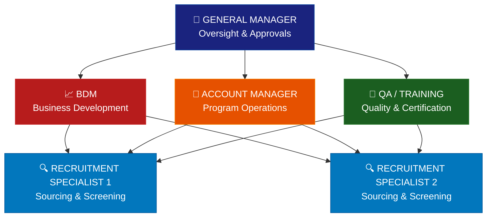

### 📋 Reporting Lines & Responsibilities

```
╔══════════════════════════════════════════════════════════════════╗
║                     ELEVEAL BPO                                  ║
║               ORGANIZATIONAL STRUCTURE                           ║
╠══════════════════════════════════════════════════════════════════╣
║                                                                  ║
║                    ┌──────────────────┐                          ║
║                    │  GENERAL MANAGER │                          ║
║                    │  ● Approvals     │                          ║
║                    │  ● Strategy      │                          ║
║                    │  ● Oversight     │                          ║
║                    └────────┬─────────┘                          ║
║              ┌──────────────┼──────────────────┐                 ║
║              │              │                  │                  ║
║     ┌────────▼───────┐ ┌───▼────────┐ ┌──────▼──────────┐      ║
║     │      BDM       │ │  ACCOUNT   │ │  QA / TRAINING  │      ║
║     │ ● Evaluations  │ │  MANAGER   │ │  ● Mock Calls   │      ║
║     │ ● Certify      │ │ ● Onboard  │ │  ● Assessment   │      ║
║     │ ● Performance  │ │ ● Training │ │  ● Validation   │      ║
║     └────────┬───────┘ └───┬────────┘ └──────┬──────────┘      ║
║              │              │                  │                  ║
║              └──────────────┼──────────────────┘                 ║
║                             │                                    ║
║                  ┌──────────▼──────────┐                         ║
║                  │  RECRUITMENT TEAM   │                         ║
║                  │  (2 Specialists)    │                         ║
║                  │  ● Sourcing         │                         ║
║                  │  ● Screening        │                         ║
║                  │  ● Scheduling       │                         ║
║                  │  ● Tracking         │                         ║
║                  └─────────────────────┘                         ║
║                                                                  ║
╚══════════════════════════════════════════════════════════════════╝
```

> **Note:** Due to startup operations, personnel may temporarily assume overlapping responsibilities based on business needs. This structure serves as a guideline, not a rigid hierarchy.

---


## 6. ROLES & RESPONSIBILITIES

### Recruitment Specialist
| Responsibility | Frequency | Tools Used |
|---------------|-----------|------------|
| Candidate sourcing (job posts, outreach) | Daily | Facebook, LinkedIn, Indeed, TikTok |
| Initial screening (resume review, pre-qualification) | Daily | Google Forms, Notion |
| Interview scheduling & coordination | Daily | Google Calendar, Calendly (free) |
| Applicant tracking & status updates | Daily | Notion/Airtable tracker |
| Follow-up communication with candidates | Daily | Messenger, Discord, Email |
| Recruitment reporting & metrics | Weekly | Google Sheets |

### Account Manager (AM)
| Responsibility | Frequency | Tools Used |
|---------------|-----------|------------|
| Program-specific evaluation of candidates | Per batch | Google Meet, Evaluation Form |
| Onboarding coordination & support | Per hire | Notion checklist |
| Training schedule coordination | Per batch | Google Calendar |
| Campaign fit assessment | As needed | Evaluation rubric |

### Business Development Manager (BDM)
| Responsibility | Frequency | Tools Used |
|---------------|-----------|------------|
| Final candidate evaluations | Per batch | Evaluation Form |
| Certification assessments | Per candidate | Scorecard template |
| Performance benchmarking | Monthly | Google Sheets |
| Quality standards oversight | Ongoing | QA checklist |

### General Manager (GM)
| Responsibility | Frequency | Tools Used |
|---------------|-----------|------------|
| Operational oversight & hiring approvals | As needed | Dashboard (Notion) |
| Budget allocation for recruitment | Monthly | Google Sheets |
| Strategic hiring decisions | As needed | — |
| SOP compliance monitoring | Quarterly | Audit checklist |

### QA / Training Team
| Responsibility | Frequency | Tools Used |
|---------------|-----------|------------|
| Mock call evaluations | Per candidate | Scorecard, Google Meet |
| Communication skills assessment | Per candidate | Rubric template |
| Training readiness validation | Per batch | Checklist |
| Certification approval | Per candidate | Sign-off form |

---


## 7. RECRUITMENT PROCESS FLOW

### 📊 Visual Pipeline Flowchart

```mermaid
flowchart LR
    A["📋 MANPOWER<br/>REQUEST<br/>Day 0"] --> B["🔍 CANDIDATE<br/>SOURCING<br/>Day 1"]
    B --> C["📝 INITIAL<br/>SCREENING<br/>Day 1-2"]
    C --> D["🎤 INITIAL<br/>INTERVIEW<br/>Day 2-3"]
    D --> E["👔 MANAGEMENT<br/>EVALUATION<br/>Day 3-4"]
    E --> F["📞 MOCK CALL<br/>CERTIFICATION<br/>Day 4-5"]
    F --> G["✅ FINAL<br/>ENDORSEMENT<br/>Day 5"]
    G --> H["🎉 JOB OFFER<br/>& ONBOARD<br/>Day 5-7"]

    style A fill:#e3f2fd,stroke:#1565c0,color:#0d47a1
    style B fill:#e8f5e9,stroke:#2e7d32,color:#1b5e20
    style C fill:#fff3e0,stroke:#e65100,color:#bf360c
    style D fill:#fce4ec,stroke:#c62828,color:#b71c1c
    style E fill:#f3e5f5,stroke:#6a1b9a,color:#4a148c
    style F fill:#e0f7fa,stroke:#00695c,color:#004d40
    style G fill:#f1f8e9,stroke:#33691e,color:#1b5e20
    style H fill:#fff9c4,stroke:#f57f17,color:#e65100
```

### 📈 Recruitment Funnel Visualization

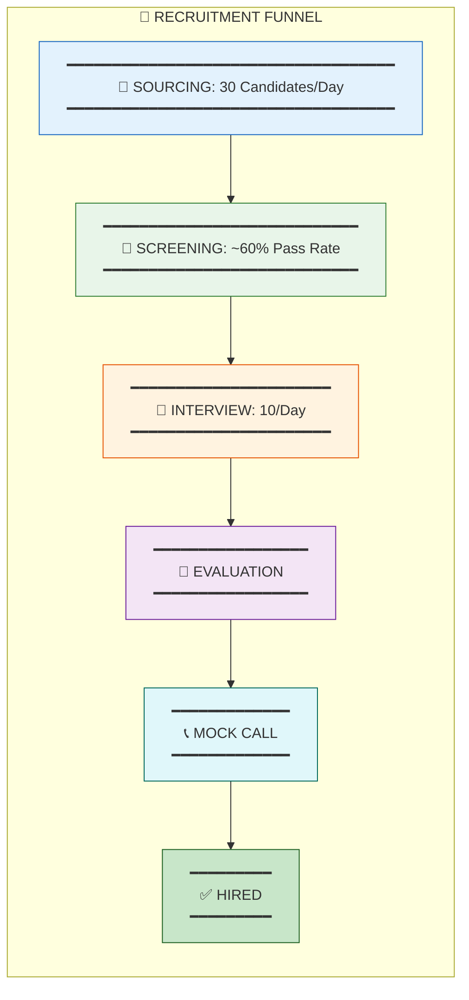

### 🕐 Timeline Chart (Target: 2-7 Days)

```
DAY 0        DAY 1        DAY 2        DAY 3        DAY 4        DAY 5        DAY 6-7
  │            │            │            │            │            │            │
  ▼            ▼            ▼            ▼            ▼            ▼            ▼
┌────┐    ┌─────────┐  ┌─────────┐  ┌─────────┐  ┌─────────┐  ┌─────────┐  ┌────────┐
│ MP │───▶│SOURCING │─▶│SCREENING│─▶│INTERVIEW│─▶│  EVAL   │─▶│MOCK CALL│─▶│ONBOARD │
│ REQ│    │         │  │         │  │         │  │         │  │  + END  │  │        │
└────┘    └─────────┘  └─────────┘  └─────────┘  └─────────┘  └─────────┘  └────────┘
  📋          🔍            📝           🎤           👔          📞✅         🎉
```

### 📊 Decision Tree at Each Stage

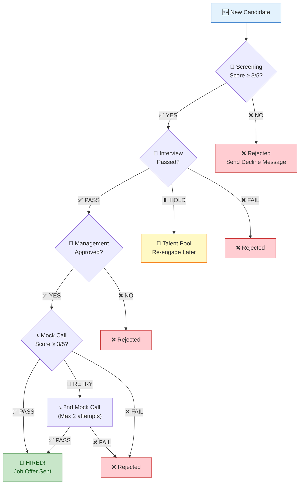

---

### STEP 1 — MANPOWER REQUEST
**Owner:** Operations / Account Manager  
**Timeline:** Day 0  
**Process:**
1. Operations submits a Manpower Request Form (Google Form) including:
   - Campaign/Program name
   - Number of positions needed
   - Required skills and experience
   - Schedule requirements
   - Start date target
   - Special qualifications (if any)
2. GM approves the request within 24 hours
3. Recruitment team acknowledges and begins sourcing

**Tool:** Google Forms → Auto-logs to Google Sheets  
**Output:** Approved manpower request with clear requirements

---

### STEP 2 — CANDIDATE SOURCING
**Owner:** Recruitment Specialists  
**Timeline:** Day 1 (ongoing)  
**Process:**
1. Post job openings on free platforms:
   - Facebook Groups & Pages (BPO/VA communities)
   - LinkedIn (free job posts)
   - Indeed (free tier)
   - TikTok (recruitment content)
   - Employee referrals
   - Online job boards (Kalibrr, JobStreet free posts)
2. Respond to applicant inquiries within 2 hours
3. Log all sourced candidates immediately in tracker
4. Tag candidates by source for analytics

**Tool:** Social media platforms, Notion/Airtable pipeline  
**Output:** Pool of interested candidates logged in tracker

---

### STEP 3 — INITIAL SCREENING
**Owner:** Recruitment Specialists  
**Timeline:** Day 1-2  
**Process:**
1. Review candidate profile/resume against requirements:
   - Communication skills (written assessment via chat)
   - Relevant experience
   - Technical setup (PC specs, internet speed, headset)
   - Schedule flexibility and availability
   - Work attitude indicators
2. Send pre-screening questionnaire (Google Form)
3. Score candidates using standardized rubric (1-5 scale)
4. Move qualified candidates to "For Interview" pipeline stage

**Screening Criteria:**

| Criteria | Weight | Minimum Score |
|----------|--------|---------------|
| Communication Skills | 30% | 3/5 |
| Relevant Experience | 25% | 3/5 |
| Technical Setup | 20% | 4/5 |
| Schedule Flexibility | 15% | 3/5 |
| Work Attitude | 10% | 3/5 |

**Tool:** Google Forms (questionnaire), Notion (pipeline tracking)  
**Output:** Shortlisted candidates moved to interview stage

---


### STEP 4 — INITIAL INTERVIEW
**Owner:** Recruitment Specialists  
**Timeline:** Day 2-3  
**Process:**
1. Schedule interview via Google Calendar (send invite with Google Meet link)
2. Conduct 15-20 minute structured interview covering:
   - Self-introduction and background
   - Communication clarity and confidence
   - Professionalism and attitude
   - Experience validation
   - Motivation and reliability indicators
   - Schedule and availability confirmation
3. Complete Interview Evaluation Form immediately after
4. Notify candidate of next steps within 24 hours

**Interview Scorecard:**

| Criteria | Score (1-5) | Notes |
|----------|-------------|-------|
| Communication Clarity | | |
| Professionalism | | |
| Confidence Level | | |
| Relevant Experience | | |
| Reliability Indicators | | |
| **Overall Recommendation** | | Pass / Hold / Fail |

**Tool:** Google Meet, Google Calendar, Evaluation Form (Google Forms)  
**Output:** Evaluated candidates with recommendation

---

### STEP 5 — MANAGEMENT EVALUATION
**Owner:** Account Manager / BDM  
**Timeline:** Day 3-4  
**Process:**
1. Recruitment endorses qualified candidates with completed evaluation forms
2. Management reviews:
   - Campaign/program fit
   - Trainability assessment
   - Operational readiness
   - Red flag review
3. Decision: Proceed / Hold / Reject
4. Feedback provided to Recruitment within 24 hours

**Tool:** Google Forms (evaluation), Notion (status tracking)  
**Output:** Management-approved candidates

---

### STEP 6 — MOCK CALL / ACCOUNT CERTIFICATION
**Owner:** QA Team / BDM / Account Manager  
**Timeline:** Day 4-5  
**Process:**
1. Schedule mock call session (Google Calendar)
2. Conduct scenario-based evaluation:
   - Customer service simulation
   - Product/service knowledge test
   - Objection handling
   - Call flow adherence
   - Tone and empathy
3. Score using Mock Call Rubric
4. Provide immediate feedback to candidate

**Mock Call Scoring:**

| Criteria | Weight | Min. Pass |
|----------|--------|-----------|
| Call Opening | 15% | 3/5 |
| Product Knowledge | 20% | 3/5 |
| Objection Handling | 25% | 3/5 |
| Communication & Tone | 25% | 4/5 |
| Call Closing | 15% | 3/5 |

**Tool:** Google Meet, Scorecard (Google Sheets)  
**Output:** Certified or needs-improvement candidates

---

### STEP 7 — FINAL ENDORSEMENT
**Owner:** BDM / GM  
**Timeline:** Day 5  
**Process:**
1. Review complete candidate package:
   - Screening results
   - Interview evaluation
   - Management assessment
   - Mock call scores
2. Final decision: Approve / Reject
3. Approved candidates move to Job Offer stage
4. Update tracker status

**Tool:** Notion dashboard, Google Sheets  
**Output:** Final approved candidate list

---

### STEP 8 — JOB OFFER & ONBOARDING
**Owner:** Recruitment Specialist + Account Manager  
**Timeline:** Day 5-7  
**Process:**
1. Extend formal job offer (via email/message) including:
   - Position title and campaign assignment
   - Compensation and payment terms
   - Work schedule
   - KPI expectations
   - Company policies summary
   - Required documents checklist
2. Candidate accepts and submits requirements
3. Onboarding checklist initiated:
   - System access setup
   - Tool installations
   - Policy acknowledgment
   - Training schedule communication
   - Team introduction
4. Training start date confirmed

**Tool:** Google Docs (offer template), Notion (onboarding checklist)  
**Output:** Deployed and onboarded agent

---


## 8. RECOMMENDED FREE TOOLS & SYSTEMS

### 📊 Tool Ecosystem Map

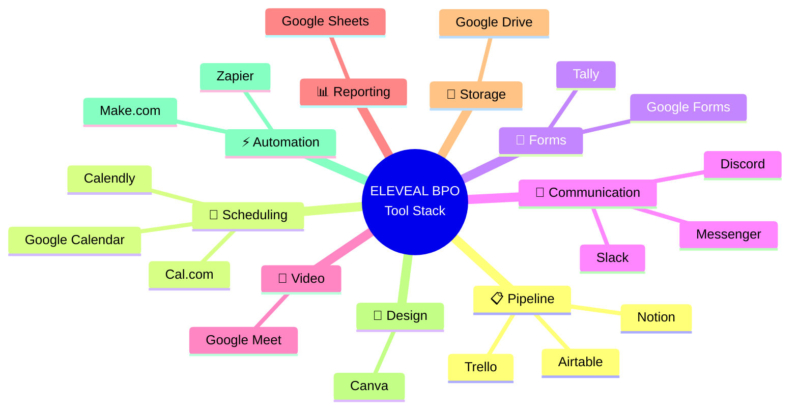

### 🔧 IMMEDIATE IMPLEMENTATION (Phase 1 — Free Tools)

| Category | Tool | Free Plan Details | Use Case |
|----------|------|-------------------|----------|
| **ATS / Pipeline** | [Notion](https://notion.so) | Free for small teams (up to 10 guests) | Candidate pipeline, kanban board, database |
| **ATS / Pipeline** | [Trello](https://trello.com) | Free (unlimited cards, up to 10 boards) | Visual recruitment pipeline with card-based tracking |
| **ATS / Pipeline** | [Airtable](https://airtable.com) | Free (1,000 records per base, 1GB attachments) | Structured candidate database with views/filters |
| **Scheduling** | [Calendly](https://calendly.com) | Free (1 event type, unlimited meetings) | Self-service interview scheduling for candidates |
| **Scheduling** | [Cal.com](https://cal.com) | Free & open-source (unlimited event types) | Interview scheduling with Google Calendar sync |
| **Forms & Surveys** | [Google Forms](https://forms.google.com) | Completely free | Screening forms, evaluation forms, feedback |
| **Forms & Surveys** | [Tally](https://tally.so) | Free (unlimited forms, unlimited submissions) | Beautiful application forms, pre-screening |
| **Communication** | [Discord](https://discord.com) | Free (unlimited users, channels) | Internal team communication, candidate staging |
| **Communication** | [Slack](https://slack.com) | Free (90-day message history, 10 integrations) | Team communication with channel organization |
| **Video Calls** | [Google Meet](https://meet.google.com) | Free (60-min group calls, unlimited 1-on-1) | Interviews, mock calls, evaluations |
| **Documents** | [Google Docs/Sheets](https://workspace.google.com) | Completely free | Offer letters, trackers, reports |
| **Storage** | [Google Drive](https://drive.google.com) | 15GB free per account | Resumes, documents, evaluation files |
| **Email** | [Gmail](https://gmail.com) | Free | Formal candidate communication |
| **Design** | [Canva](https://canva.com) | Free tier with templates | Job post graphics, social media recruitment ads |

---

### 🚀 SHORT-TERM UPGRADE (Phase 2 — Enhanced Free/Freemium Tools)

| Category | Tool | Free Plan Details | Use Case |
|----------|------|-------------------|----------|
| **ATS** | [Zoho Recruit](https://www.zoho.com/recruit/) | Free (1 active job, candidate management) | Proper ATS with pipeline stages |
| **ATS** | [Breezy HR](https://breezy.hr) | Free (1 active position, unlimited candidates) | Visual pipeline, candidate scorecards |
| **Project Management** | [ClickUp](https://clickup.com) | Free (unlimited tasks, 100MB storage) | Recruitment project management, task assignment |
| **Automation** | [Make (Integromat)](https://www.make.com) | Free (1,000 operations/month) | Auto-move candidates between stages, send notifications |
| **Automation** | [Zapier](https://zapier.com) | Free (5 zaps, 100 tasks/month) | Connect Google Forms to Notion/Sheets automatically |
| **Knowledge Base** | [Notion Wiki](https://notion.so) | Free | SOPs, training materials, company handbook |
| **Time Tracking** | [Toggl Track](https://toggl.com/track/) | Free (up to 5 users) | Track recruiter productivity |
| **Surveys** | [Typeform](https://typeform.com) | Free (10 questions per form) | Candidate experience surveys |

---

### 📈 LONG-TERM SCALING (Phase 3 — When Budget Allows)

| Category | Tool | Starting Price | Use Case |
|----------|------|---------------|----------|
| **Full HRIS** | [Zoho People](https://www.zoho.com/people/) | Free up to 5 users | Complete HR management |
| **ATS + CRM** | [Manatal](https://www.manatal.com) | $15/user/month | AI-powered recruitment |
| **HR Platform** | [Freshteam (Freshworks)](https://www.freshworks.com/hrms/) | Free up to 50 employees | Full recruitment + HR |
| **All-in-One** | [Bitrix24](https://www.bitrix24.com) | Free (up to 5 users, 5GB) | CRM + HR + Project Management |
| **Onboarding** | [Scribe](https://scribehow.com) | Free (unlimited guides) | Auto-generate training documentation |

---

### 💡 TOOL STACK RECOMMENDATION (Immediate Setup — $0 Cost)

**Recommended Starter Stack for Eleveal BPO:**

```
📋 Pipeline Tracking  →  Notion (Kanban + Database)
📅 Scheduling         →  Calendly (Free) + Google Calendar
📝 Forms              →  Tally (applications) + Google Forms (evaluations)
💬 Communication      →  Discord (internal) + Messenger (candidates)
🎥 Interviews         →  Google Meet
📊 Reporting          →  Google Sheets (dashboards)
📁 Storage            →  Google Drive
🎨 Job Posts          →  Canva (graphics) + free platforms
⚡ Automation         →  Make.com (connect forms → tracker)
```

---


## 9. REQUIRED TRACKERS & DOCUMENTATION

### A. Recruitment Master Tracker (Notion/Airtable)
**Purpose:** Single source of truth for all candidates  
**Fields:**
- Candidate Name
- Contact Information
- Source (Facebook, LinkedIn, Indeed, Referral, etc.)
- Date Applied
- Position/Campaign Applied For
- Current Pipeline Stage
- Screening Score
- Interview Score
- Evaluator Name
- Status (Active / On Hold / Rejected / Hired)
- Notes/Comments
- Date of Last Action

### B. Daily Recruitment Activity Log (Google Sheets)
**Purpose:** Track daily recruiter productivity  
**Fields:**
- Date
- Recruiter Name
- Candidates Sourced
- Candidates Screened
- Interviews Scheduled
- Interviews Conducted
- No-Shows
- Candidates Endorsed
- Notes

### C. Onboarding Tracker (Notion Checklist)
**Purpose:** Ensure no onboarding step is missed  
**Checklist Items:**
- [ ] Job offer sent and accepted
- [ ] Required documents submitted (ID, resume, TIN, etc.)
- [ ] System access provided
- [ ] Tools installed and tested
- [ ] Company policies acknowledged
- [ ] Training schedule confirmed
- [ ] Team introduction completed
- [ ] First-day check-in scheduled
- [ ] 7-day follow-up scheduled
- [ ] 30-day performance review scheduled

### D. Interview Calendar (Google Calendar)
**Purpose:** Prevent scheduling conflicts  
**Rules:**
- All interviews must be calendar-blocked
- 15-minute buffer between interviews
- Shared calendar visible to all hiring personnel
- Color-coding by interview stage

### E. Candidate Communication Log
**Purpose:** Track all candidate interactions  
**Maintained in:** Notion/Discord thread  
**Required entries:**
- Every message sent/received
- Interview confirmations
- Status change notifications
- Offer communications

---


## 10. RECRUITMENT KPIs & METRICS

### 📊 KPI Performance Dashboard

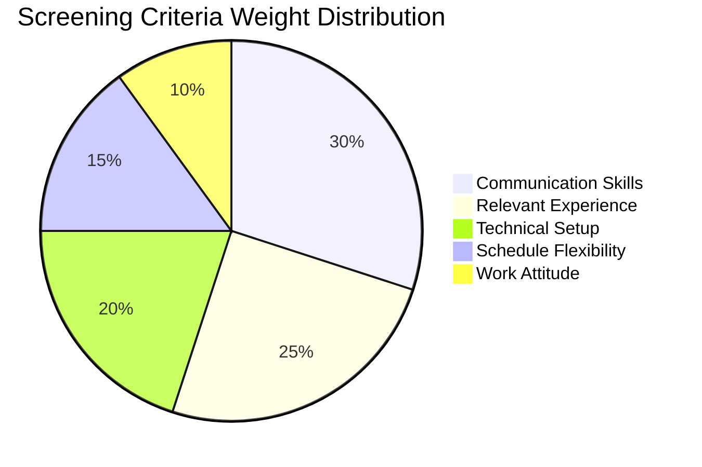

### 📈 Target Conversion Funnel

```
┌─────────────────────────────────────────────────────────────────────────┐
│                    DAILY RECRUITMENT TARGETS                              │
├─────────────────────────────────────────────────────────────────────────┤
│                                                                          │
│  ████████████████████████████████████████████  30/day  ← SOURCED        │
│  ████████████████████████████████             20/day  ← SCREENED        │
│  ████████████████████                         10/day  ← INTERVIEWED     │
│  ████████████████                              8/day  ← SHOWED UP (80%) │
│  ██████████████                                7/day  ← ENDORSED        │
│  ████████████                                  6/day  ← CERTIFIED       │
│  ██████████                                    5/day  ← HIRED           │
│                                                                          │
│  CONVERSION RATE: ~17% (Sourced → Hired)                                │
│                                                                          │
└─────────────────────────────────────────────────────────────────────────┘
```

### 📉 KPI Scorecard Visual

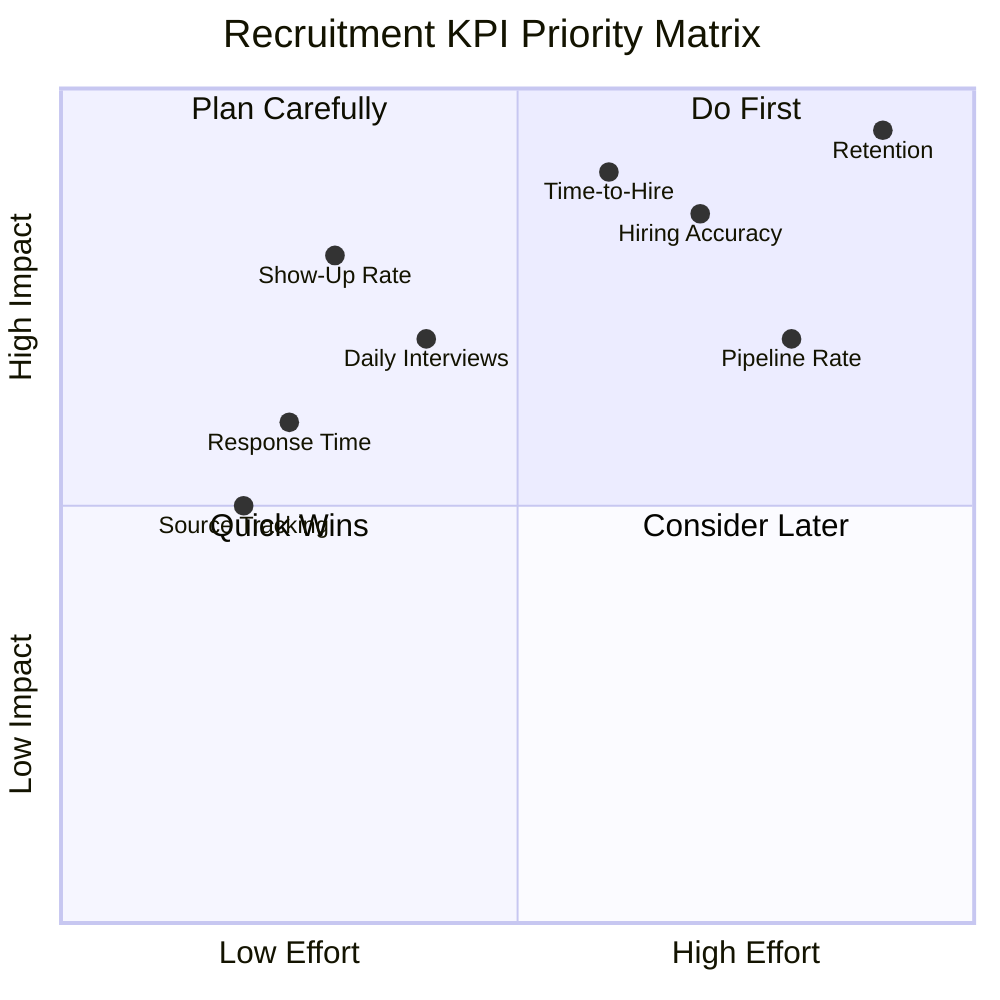

### Primary KPIs

| KPI | Target | Measurement Method | Frequency |
|-----|--------|-------------------|-----------|
| Applicant Engagement | 30 candidates/day | Daily Activity Log | Daily |
| Daily Interviews Conducted | 10 interviews/day | Calendar + Tracker | Daily |
| Interview Show-Up Rate | ≥ 80% | Scheduled vs. Attended | Weekly |
| Hiring Accuracy | ≥ 85% | Hires passing training / Total hires | Monthly |
| Training Pass Rate | ≥ 75% | Certified / Total trainees | Per batch |
| Time-to-Hire | 2–5 business days | Request date → Deployment date | Per hire |
| Offer Acceptance Rate | ≥ 90% | Offers accepted / Offers extended | Monthly |
| First-30-Day Retention | ≥ 80% | Active at 30 days / Total deployed | Monthly |

### Secondary KPIs

| KPI | Target | Measurement |
|-----|--------|-------------|
| Source Effectiveness | Track top 3 sources | Hires per source channel |
| Cost-per-Hire | $0 (free channels) | Total spend / Total hires |
| Recruiter Productivity | 30 touchpoints/day | Daily log review |
| Candidate Response Time | < 2 hours | Message timestamps |
| Pipeline Conversion Rate | ≥ 20% | Hires / Total applicants |

### KPI Dashboard (Google Sheets)
- Updated weekly by Recruitment Specialists
- Reviewed in weekly recruitment sync meeting
- Monthly summary presented to GM
- Trends tracked for quarterly optimization

---

## 11. COMMUNICATION PROTOCOL

### 📊 Communication Flow Diagram

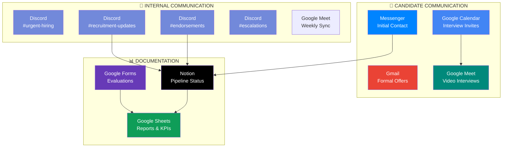

### ⏱️ Response Time Standards

```
URGENCY LEVELS & RESPONSE TIMES
━━━━━━━━━━━━━━━━━━━━━━━━━━━━━━━━━━━━━━━━━━━━━━━━━━━━━━━━━━

🔴 CRITICAL   │< 30 min │ ████░░░░░░░░░░░░ │ Urgent hiring, complaints
🟠 HIGH       │< 2 hrs  │ ████████░░░░░░░░ │ Candidate inquiries, updates
🟡 STANDARD   │< 4 hrs  │ ████████████░░░░ │ Endorsements, scheduling
🟢 LOW        │< 24 hrs │ ████████████████ │ Reports, formal offers
━━━━━━━━━━━━━━━━━━━━━━━━━━━━━━━━━━━━━━━━━━━━━━━━━━━━━━━━━━
```

### Mandatory Rules:
1. **All candidate updates must be documented** — No verbal-only endorsements
2. **Interview results logged immediately** — Within 30 minutes of completion
3. **Status changes communicated same-day** — To all relevant stakeholders
4. **Recruitment ↔ Operations sync** — Daily standup (15 min via Discord)

### Communication Channels:

| Purpose | Channel | Response Time |
|---------|---------|---------------|
| Urgent hiring needs | Discord #urgent-hiring | < 30 minutes |
| Daily updates | Discord #recruitment-updates | < 2 hours |
| Candidate endorsements | Discord #endorsements + Notion tag | < 4 hours |
| Interview scheduling | Google Calendar invite | < 24 hours |
| Formal offers | Email (Gmail) | < 24 hours |
| Candidate inquiries | Messenger/Discord | < 2 hours |
| Weekly reports | Google Sheets + Discord #reports | Every Friday |

### Meeting Cadence:

| Meeting | Frequency | Duration | Attendees | Tool |
|---------|-----------|----------|-----------|------|
| Daily Recruitment Sync | Daily (Mon-Fri) | 15 min | Recruiters + AM | Discord voice |
| Pipeline Review | Weekly (Monday) | 30 min | Recruiters + AM + BDM | Google Meet |
| Hiring Status Report | Weekly (Friday) | 15 min | All stakeholders | Discord / Sheets |
| Monthly Recruitment Review | Monthly | 45 min | Full team + GM | Google Meet |

---


## 12. CANDIDATE EXPERIENCE STANDARDS

### 📊 Candidate Journey Map

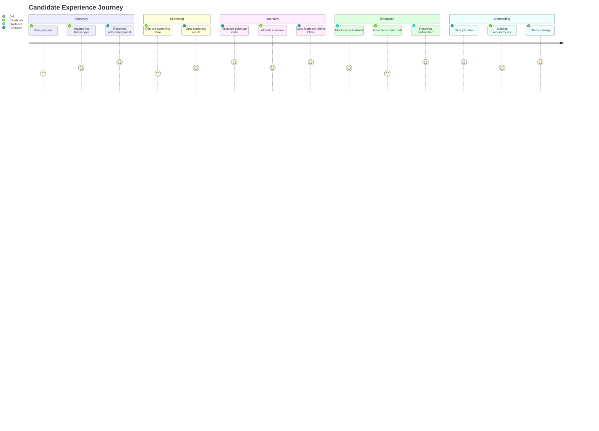

### ⏱️ Candidate Communication SLA

```
CANDIDATE TOUCHPOINT TIMELINE
━━━━━━━━━━━━━━━━━━━━━━━━━━━━━━━━━━━━━━━━━━━━━━━━━━━━━━━━━━━━━━━

  📩 Application    ──── ⏱️ 2 HRS ────▶  ✅ Acknowledgment Sent
  
  📝 Screening      ──── ⏱️ 24 HRS ───▶  ✅ Result Notification
  
  📅 Interview Set  ──── ⏱️ 24 HRS ───▶  ✅ Calendar Invite Sent
  
  🎤 Post-Interview ──── ⏱️ 24 HRS ───▶  ✅ Status Update
  
  ❌ Rejection      ──── ⏱️ 48 HRS ───▶  ✅ Professional Decline
  
  🎉 Job Offer      ──── ⏱️ 24 HRS ───▶  ✅ Formal Communication

━━━━━━━━━━━━━━━━━━━━━━━━━━━━━━━━━━━━━━━━━━━━━━━━━━━━━━━━━━━━━━━
```

### Principles:
- Every candidate represents potential brand advocacy — treat all with respect
- Timely communication prevents candidate drop-off
- Clear expectations reduce no-shows and misalignment

### Candidate Communication Timeline:

| Stage | Action | Timeline |
|-------|--------|----------|
| Application received | Acknowledgment message | Within 2 hours |
| Screening complete | Result notification | Within 24 hours |
| Interview scheduled | Calendar invite + reminder | 24 hours before |
| Post-interview | Status update | Within 24 hours |
| Rejection | Professional decline message | Within 48 hours |
| Offer | Formal offer communication | Within 24 hours of approval |

### Template Messages (Maintain in Google Docs):
- Application acknowledgment template
- Interview invitation template
- Interview reminder template (24hr and 1hr before)
- Post-interview thank you template
- Rejection template (professional and encouraging)
- Offer letter template
- Onboarding welcome template

---

## 13. CONFIDENTIALITY & DATA PRIVACY

### Policy:
All applicant information is **strictly confidential** and accessible only to authorized personnel.

### Protected Information Includes:
- Resumes and CVs
- Personal identification documents
- Contact details (phone, email, address)
- Interview notes and evaluation scores
- Salary/compensation details
- Medical information (if disclosed)
- References and background check results

### Data Handling Rules:
1. All digital files stored in secured Google Drive folders with restricted access
2. No sharing of candidate data outside authorized personnel
3. Candidate data retained for 6 months after last interaction, then archived
4. Candidates may request data deletion at any time
5. No candidate information shared on public channels or group chats
6. Evaluation forms accessible only to evaluators and management

### Access Levels:

| Role | Access Level |
|------|-------------|
| Recruitment Specialist | Full candidate data for active pipeline |
| Account Manager | Endorsed candidates only |
| BDM | Final-stage candidates only |
| GM | All data (read-only dashboard) |
| QA/Training | Certified candidates only |

---

## 14. ESCALATION PROCEDURES

### 📊 Escalation Flow Diagram

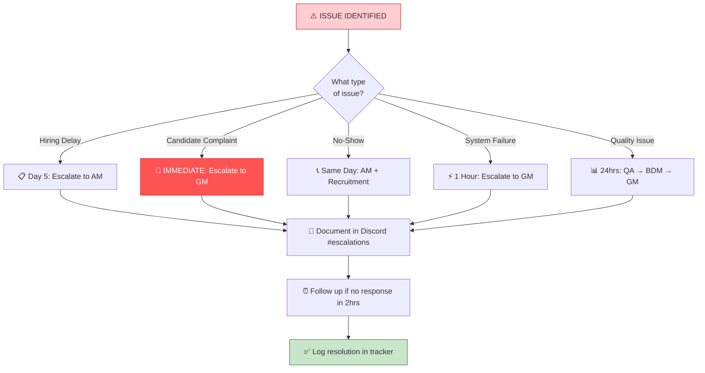

### When to Escalate:

| Situation | Escalate To | Timeline |
|-----------|-------------|----------|
| Unable to fill position within 5 days | Account Manager → BDM | Day 5 |
| Candidate complaint or dispute | GM | Immediately |
| Candidate no-show for deployment | AM + Recruitment | Same day |
| Technical/system failure affecting hiring | GM | Within 1 hour |
| Budget approval needed | GM | Before action |
| Candidate withdraws after offer | AM + Recruitment | Same day |
| Quality issue with recent hire | QA → BDM → GM | Within 24 hours |

### Escalation Process:
1. Document the issue in Discord #escalations channel
2. Tag the appropriate escalation contact
3. Provide context: candidate name, position, timeline, issue summary
4. Follow up if no response within 2 hours
5. Log resolution in tracker

---


## 15. FUTURE SCALING PLAN

### 📊 Growth Roadmap Timeline

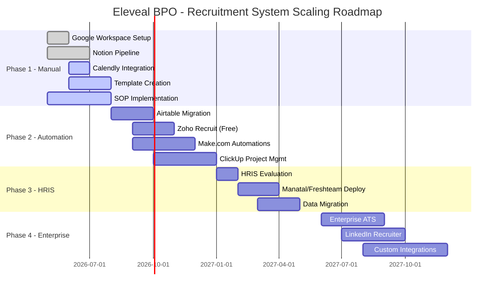

### 💰 Budget Progression Chart

```
MONTHLY INVESTMENT OVER TIME
━━━━━━━━━━━━━━━━━━━━━━━━━━━━━━━━━━━━━━━━━━━━━━━━━━━━━━

Phase 1 (Now)          │ $0/mo
                       │ ░░░░░░░░░░░░░░░░░░░░░░░░░░░░░░░░░░░
                       │ ALL FREE TOOLS
                       │
Phase 2 (3-6 mo)      │ $0-50/mo
                       │ ▓▓▓░░░░░░░░░░░░░░░░░░░░░░░░░░░░░░░
                       │ Free + Freemium Upgrades
                       │
Phase 3 (6-12 mo)     │ $50-200/mo
                       │ ▓▓▓▓▓▓▓▓▓▓░░░░░░░░░░░░░░░░░░░░░░░
                       │ HRIS + AI-Powered ATS
                       │
Phase 4 (12+ mo)      │ $200-500/mo
                       │ ▓▓▓▓▓▓▓▓▓▓▓▓▓▓▓▓▓▓░░░░░░░░░░░░░░
                       │ Enterprise Suite
━━━━━━━━━━━━━━━━━━━━━━━━━━━━━━━━━━━━━━━━━━━━━━━━━━━━━━
```

### 🏗️ Tool Stack Evolution

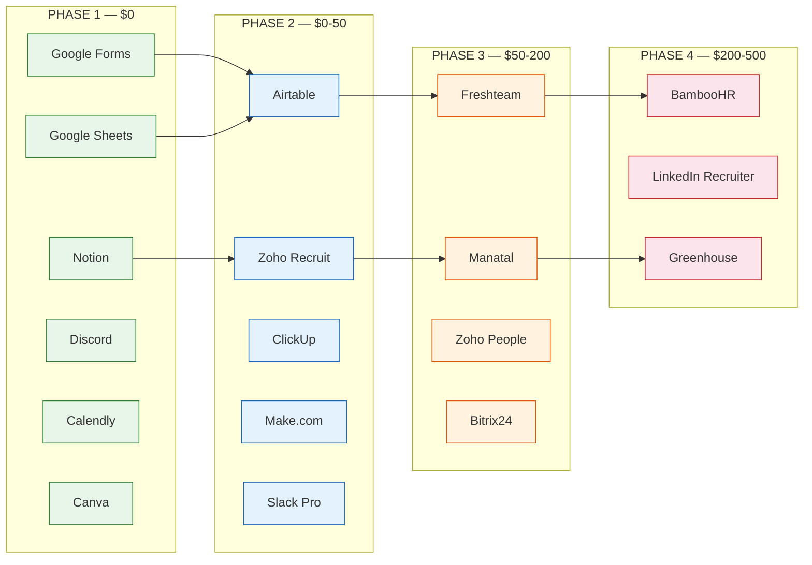

### Phase 1 — Current State (Manual Operations) ✅
**Timeline:** Now  
**Budget:** $0  
**Tools:**
- Google Workspace (Forms, Sheets, Docs, Calendar, Meet, Drive)
- Notion (free — pipeline tracking, onboarding checklists)
- Calendly / Cal.com (free — interview scheduling)
- Tally (free — application forms)
- Canva (free — job post graphics)
- Discord (free — internal communication)
- Make.com (free — basic automation)

**Focus:** Establish processes, build templates, standardize workflows

---

### Phase 2 — Basic Automation (3-6 months)
**Timeline:** When consistent hiring volume established  
**Budget:** $0-50/month  
**Tools to Add:**
- Airtable (free/paid — structured candidate database)
- Zoho Recruit (free tier — proper ATS)
- ClickUp (free — recruitment project management)
- Make.com / Zapier (expanded automation)
- Loom (free — async video communication)

**Focus:** Reduce manual tasks, improve tracking accuracy, scale candidate volume

---

### Phase 3 — HRIS Integration (6-12 months)
**Timeline:** When team grows to 5+ recruiters or 50+ employees  
**Budget:** $50-200/month  
**Tools to Add:**
- Zoho People or Freshteam (HRIS)
- Manatal (AI-powered ATS)
- Bitrix24 (all-in-one CRM + HR)
- Scribe (automated documentation)

**Focus:** Full HR lifecycle management, AI-assisted screening, performance tracking

---

### Phase 4 — Enterprise Operations (12+ months)
**Timeline:** When revenue supports investment  
**Budget:** $200-500/month  
**Tools to Consider:**
- BambooHR / Rippling (enterprise HRIS)
- LinkedIn Recruiter (premium sourcing)
- Workable / Greenhouse (enterprise ATS)
- Custom integrations and workflows

**Focus:** Employer branding, talent analytics, retention programs, global hiring

---

## 16. REVISION HISTORY

| Version | Date | Changes | Prepared By |
|---------|------|---------|-------------|
| 1.0 | Initial Release | Original SOP creation | Management |
| 2.0 | May 25, 2026 | Complete overhaul: Added free tool recommendations, structured process flow with timelines, scoring rubrics, KPI dashboard, communication protocols, candidate experience standards, escalation procedures, detailed scaling plan, organizational chart | Management + Kiro AI |

---

## APPENDIX A — QUICK REFERENCE CARD

### Daily Checklist for Recruitment Specialists:
- [ ] Check all sourcing platforms for new applicants
- [ ] Respond to candidate inquiries (< 2 hours)
- [ ] Update candidate pipeline statuses in Notion
- [ ] Conduct scheduled interviews
- [ ] Log interview results immediately
- [ ] Send follow-up messages to candidates
- [ ] Update Daily Activity Log
- [ ] Sync with team on Discord (15 min standup)
- [ ] Endorse qualified candidates to management
- [ ] Send interview reminders for next day

### Weekly Checklist:
- [ ] Update recruitment dashboard/KPIs
- [ ] Review pipeline for stale candidates (>3 days no action)
- [ ] Attend weekly pipeline review meeting
- [ ] Submit weekly report (Friday)
- [ ] Review and refresh job postings
- [ ] Analyze source effectiveness
- [ ] Plan next week's sourcing strategy

---

## APPENDIX B — TEMPLATE LINKS (To Be Created)

| Template | Format | Location |
|----------|--------|----------|
| Manpower Request Form | Google Form | [Link TBD] |
| Pre-Screening Questionnaire | Google Form / Tally | [Link TBD] |
| Interview Evaluation Form | Google Form | [Link TBD] |
| Mock Call Scorecard | Google Sheets | [Link TBD] |
| Management Evaluation Form | Google Form | [Link TBD] |
| Job Offer Template | Google Docs | [Link TBD] |
| Onboarding Checklist | Notion | [Link TBD] |
| Rejection Message Template | Google Docs | [Link TBD] |
| Daily Activity Log | Google Sheets | [Link TBD] |
| Recruitment Master Tracker | Notion / Airtable | [Link TBD] |
| Weekly Report Template | Google Sheets | [Link TBD] |

---

*End of Document*

> **Note:** This SOP is a living document and should be reviewed quarterly or whenever significant operational changes occur. All team members are responsible for adhering to these procedures and suggesting improvements.
